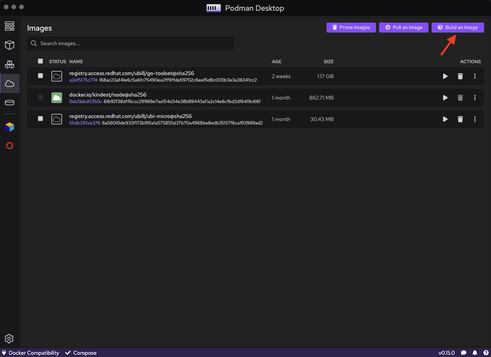
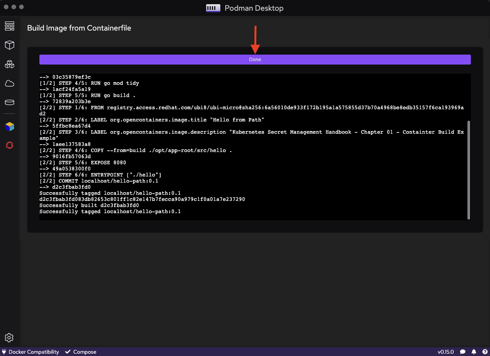
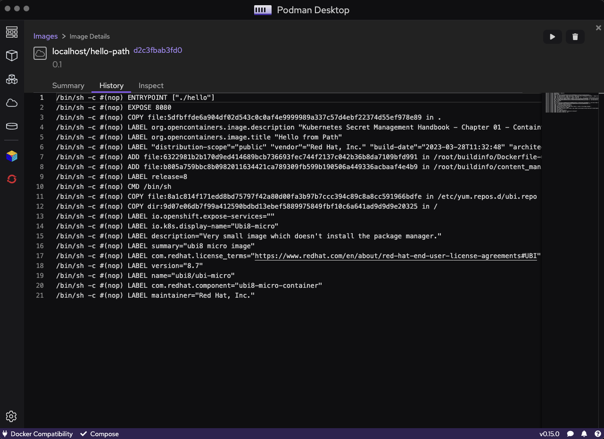
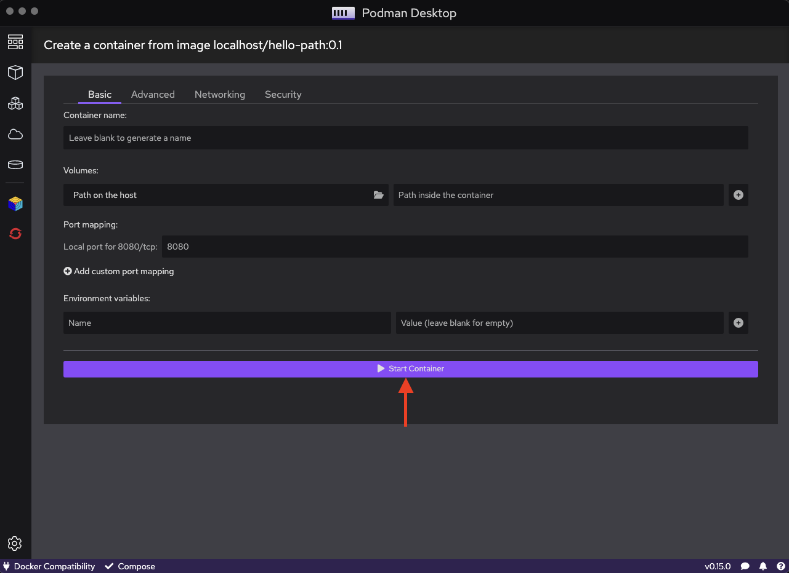
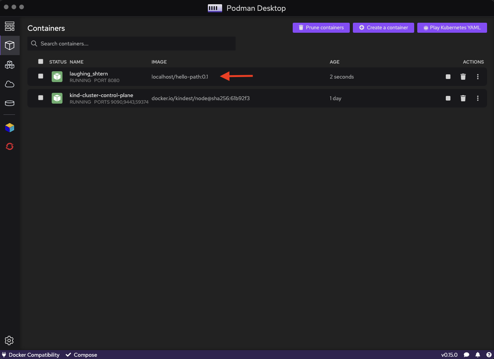

# Kubernetes Secret Management Handbook

## Chapter 1 - Example 1
### Overview and outcomes
This example provides a walktrough to build the binary of our "Hello World" Golang flavor, run it using Podman Dekstop, then deploy the same application on Kubernetes. 

The goals are too:
- refresh knowledge about building a container image
- perform the build and run on your local environment
- deploy on Kubernetes and discover the differences with Podman (or Docker)

### Get your environment ready
First clone the git repository:  
```
git clone https://github.com/PacktPublishing/Kubernetes-Secret-Management-Handbook.git 
```

Verify that the folder is available with your environment:  
```
ls -al
total 16
drwxr-xr-x   4 romdalf  staff   128 May  6 15:55 .
drwxr-xr-x  12 romdalf  staff   384 May  6 15:55 ..
-rw-r--r--@  1 romdalf  staff  6148 May  6 15:07 .DS_Store
drwxr-xr-x@  7 romdalf  staff   224 May  4 12:16 Kubernetes-Secret-Management-Handbook
```

Go in the folder and the relevant chapter and example:  
```
cd Kubernetes-Secret-Management-Handbook/ch01/example01/
```

Have a look at the content:  
``` 
ls -al
total 16
drwxr-xr-x@ 5 romdalf  staff  160 May  6 15:49 .
drwxr-xr-x@ 3 romdalf  staff   96 May  4 12:08 ..
-rw-r--r--@ 1 romdalf  staff  582 May  4 12:33 Dockerfile
drwxr-xr-x@ 3 romdalf  staff   96 May  4 12:33 hello
-rw-r--r--  1 romdalf  staff  819 May  6 15:57 readme.md
```

There is a 3 items:    

* Dockerfile; a build manifest to instruct Podman the steps to compil the Golang code into a binary and build the container image.
* hello; a folder containing the ```main.go``` file containing the code of our "Hello World".
* readme.md; this how-to file.

## Build
### The Golang code
The "Hello World" code perform the followings:

* start a webserver on port 8080
* print in the browser the message "Hello from path: *URL path*"
* print at the console the message "User request the URL path: *URL path*" 

```Go
package main

import (
    "fmt"
    "log"
    "net/http"
)

func main() {

        // print the hello message with the URL path 
        http.HandleFunc("/", func(w http.ResponseWriter, r *http.Request) {
        fmt.Fprintf(w, "Hello from URL path: %s\n", r.URL.Path)

                // if URL path is root - propose a test
                if r.URL.Path == "/" {
                        fmt.Fprintf(w, "Try to add /packt as a path.")
                }

                // print the URL path at the console
                if r.URL.Path != "/favicon.ico" {
                        fmt.Printf("User requested the URL path: %s\n", r.URL.Path)
                }
    })

        // print message at the console
        fmt.Println("Kubernetes Secret Management Handbook - Chapter 1 - Example 1 - Hello World")
        fmt.Println("--> Server running on http://localhost:8080")

        // start the service and listen on the given port
    if err := http.ListenAndServe(":8080", nil); err != nil {
                // print error messages at the console
                log.Fatal(err)
        }
}
```

### The Dockerfile
The Dockerfile perform the followings:

* fetch the Red Hat Universal Base Image with the Golang Toolset as a build image only
* copy the "Hello World" code and build a binary
* fetch the micro Red Hat Universal Base Image and copy the binary in it
* Reference a port exposure, here port 8080
* Reference the binary as an entrypoint

```Docker
FROM registry.access.redhat.com/ubi8/go-toolset@sha256:168ac23af41e6c5a6fc75490ea2ff9ffde59702c6ee15d8c005b3e3a3634fcc2 AS build

COPY ./hello/* .
RUN go mod init hello 
RUN go mod tidy
RUN go build .

FROM registry.access.redhat.com/ubi8/ubi-micro@sha256:6a56010de933f172b195a1a575855d37b70a4968be8edb35157f6ca193969ad2
LABEL org.opencontainers.image.title "Hello from Path"
LABEL org.opencontainers.inage.description "Kubernetes Secret Management Handbook - Chapter 01 - Containter Build Example"

COPY --from=build ./opt/app-root/src/hello .

EXPOSE 8080
ENTRYPOINT ["./hello"]
```

### Build the "Hello World" image from the Podman Desktop 

Within Podman Desktop, click on the *Cloud* icon leading to the container images:


Then, click the *Build an image* button in the top right corner:


Fill in the form and provide a tag using the ```localhost/``` prefix then click the *Build* button: 


Review the logs and click *Done*: 


Back to the container image lists, the newly container image we built is now available. Click on it:


Browse the details of the "Hello World" container image:


### Build the "Hello World" image from the CLI 
From the path ```Kubernetes-Secret-Management-Handbook/ch01/example01/```, run the following command:

```bash 
podman build . --tag hello-path:0.1
```

This will instruct Podman to look for a Dockerfile within the current directory and build the containter image with *hello-path:0.1* as the name and version or the so-called tag.

The output should be similar to:

```console
[1/2] STEP 1/5: FROM registry.access.redhat.com/ubi8/go-toolset@sha256:168ac23af41e6c5a6fc75490ea2ff9ffde59702c6ee15d8c005b3e3a3634fcc2 AS build
[1/2] STEP 2/5: COPY ./hello/* .
--> 934c2e8c3831
[1/2] STEP 3/5: RUN go mod init hello 
go: creating new go.mod: module hello
go: to add module requirements and sums:
        go mod tidy
--> 140584340d42
[1/2] STEP 4/5: RUN go mod tidy
--> 8276c33a5da9
[1/2] STEP 5/5: RUN go build .
--> 88a1f5da22d4
[2/2] STEP 1/6: FROM registry.access.redhat.com/ubi8/ubi-micro@sha256:6a56010de933f172b195a1a575855d37b70a4968be8edb35157f6ca193969ad2
[2/2] STEP 2/6: LABEL org.opencontainers.image.title "Hello from Path"
--> 9d3ccc166e60
[2/2] STEP 3/6: LABEL org.opencontainers.inage.description "Kubernetes Secret Management Handbook - Chapter 01 - Containter Build Example"
--> 8441f37e701c
[2/2] STEP 4/6: COPY --from=build ./opt/app-root/src/hello .
--> f01d2c53e467
[2/2] STEP 5/6: EXPOSE 8080
--> 5aec7a2bf7ec
[2/2] STEP 6/6: ENTRYPOINT ["./hello"]
[2/2] COMMIT hello-path:0.1
--> ab5c96d0ab85
Successfully tagged localhost/hello-path:0.1
ab5c96d0ab858d3fe735bb7e1586197001d8da36abd8d76df8b1f2a6f263071b
```

Finally, use the following command to verify the image status:

```bash
podman images
REPOSITORY                                  TAG         IMAGE ID      CREATED         SIZE
localhost/hello-path                        0.1         ab5c96d0ab85  13 seconds ago  36.8 MB
<none>                                      <none>      88a1f5da22d4  14 seconds ago  1.18 GB
registry.access.redhat.com/ubi8/go-toolset  <none>      a2ef5175c774  12 days ago     1.17 GB
registry.access.redhat.com/ubi8/ubi-micro   <none>      55db292ce376  5 weeks ago     30.4 MB
```

## Run

### Run "Hello World" using Podman Desktop

To run our freshly built container "Hello World" from Podman Desktop, click on the *Play* icon:


Then, at the current stage, don't change anything parameters and click the *Start Container* button:


This will open the *Containers* view and show our image running with a random name. 
This is due to the fact that we did not give. Click on the container entry:


The *Logs* tab will open a console showing our container logs. Open an Internet Browser and type type in the URL shown in the logs ```https://localhost:8080```. This should shows a message in the browser as well as in the container logs. Change the URL path with ```/packt``` or anything else and observe the behavior.  


**Congratulation! You just built and ran your first container application.** 

### Run "Hello World using Kubernetes

